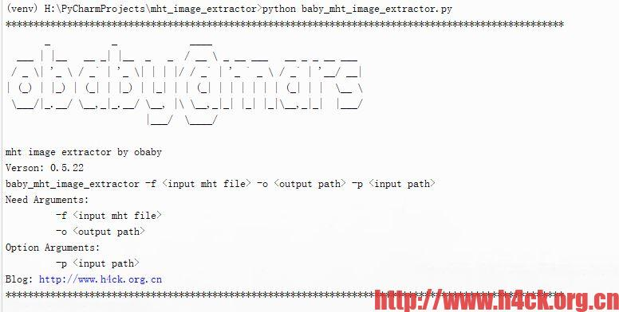
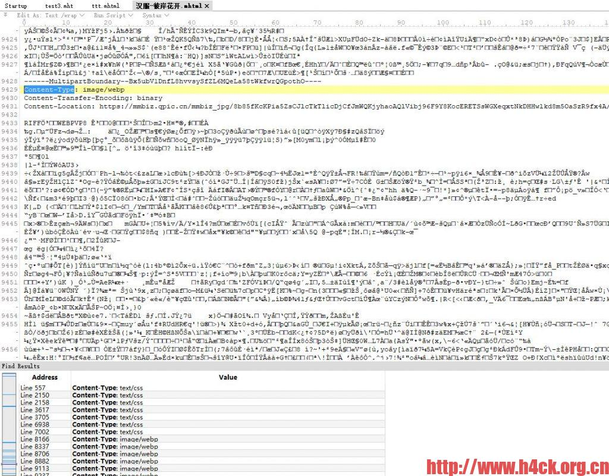
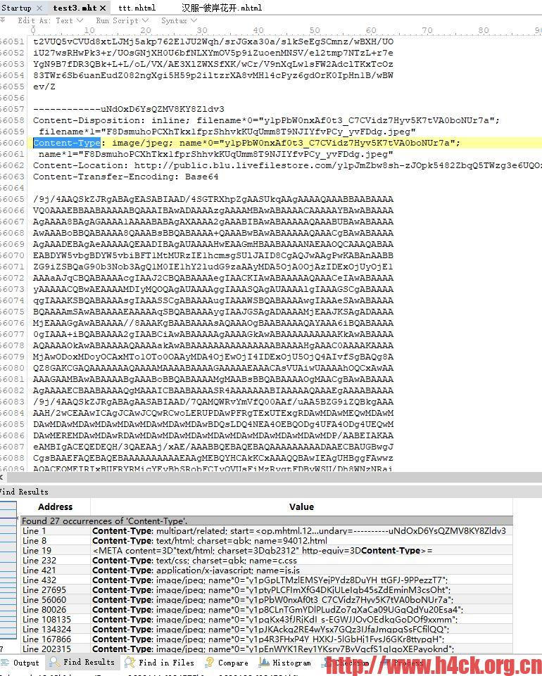

# .mht 文件图片解析工具

http://h4ck.org.cn/2020/05/mht文件图片解析工具/

http://h4ck.org.cn/2020/09/mht文件图片解析工具（兼容chrome-blink）/

https://github.com/obaby/mht-image-extractor

# =================

网上找了一下没有找到比较现成的好用的工具，找到一个 mht-viewer 的 windows 下的查看工具，但是实际实用的时候发现啥都看不了，就是个文本编辑器？还是我打开的姿势不对？


并且对于中文目录和文件名直接无法显示，我都不知道查看的是什么东西,就这个还尼玛有付费版本？

搜索了一下发现了几个 python 脚本，实际使用效果也一般。网上搜索了一下并没有找到相关的文件格式的说明

直接查看文件就可以发现文件格式并不是十分复杂，于是可以遍历来解析文件中的图片

已经保存的图片如下：

在文件中的存储结构如下：


虽然现在 mht 文件中的资源链接已经全部都挂了，但是所有的资源都是本地保存的，所以要还原对应的图片，只需要将对应的 base64 加密的字符串解密，然后写入文件即可

资源的存储方式则是通过 "boundary=----------pMKI1vNl6U7UKeGzbfNTyN" 进行分隔，在文件的第一行已经定义了边界分隔字符串，通过这个值即可将所有的资源全部分隔出来

- 第一段

```
Content-Type: multipart/related; start=<op.mhtml.1267442701515.fe60c16c115c15f9@169.254.195.209>; boundary=----------pMKI1vNl6U7UKeGzbfNTyN
Content-Location: http://a.10xjw.com/feizhuliu/89905.html
Subject: =?utf-8?Q?=E8=B6=85=E7=BE=8E=E4=B8=9D=E6=8E=A7=E5=A7=90=E5=A6=B9=E8=8A=B1=E7=A7=92=E6=9D=80=E4=BD=A0=E6=B2=A1=E9=97=AE=E9=A2=98[26P]-=2037kxw.com=20-=20=E4=B8=AD=E5=9B=BD=E6=9C=80=E5=A4=A7=E7=9A=84=E8=89=B2=E6=83=85=E5=88=86=E4=BA=AB=E7=BD=91=E7=AB=99?=
MIME-Version: 1.0
```

第一段定义了文件类型 边界 原始 url 原始网页标题以及 版本号

- 第二段

```
------------pMKI1vNl6U7UKeGzbfNTyN
Content-Disposition: inline; filename=89905.html
Content-Type: text/html; charset=gbk; name=89905.html
Content-ID: <op.mhtml.1267442701515.fe60c16c115c15f9@169.254.195.209>
Content-Location: http://a.10xjw.com/feizhuliu/89905.html
```

第二段则定义了 html 源码相关的内容，具体可以参考相关的源码

- 后续段落

```
------------pMKI1vNl6U7UKeGzbfNTyN
Content-Disposition: inline; filename=c.css
Content-Type: text/css; charset=gbk; name=c.css
Content-Location: http://a.10xjw.com/c.css
Content-Transfer-Encoding: 8bit
```

后续段落则开始记录相关的资源包括 css 图片 js 等所有的资源信息。所以 mht 文件的好处是一个文件记录了所有的内容，并且即使原始网络资源已经无法访问也可以正常的浏览

而我这里关注的则只有图片信息， 图片信息结构如下：

```
------------pMKI1vNl6U7UKeGzbfNTyN
Content-Disposition: inline; filename=771d2ad986.jpg
Content-Type: image/jpeg; name=771d2ad986.jpg
Content-Location: http://himg2.huanqiu.com/attachment/091012/771d2ad986.jpg
Content-Transfer-Encoding: Base64
```

```
/9j/4AAQSkZJRgABAQEA8ADwAAD/2wBDAAkGBgYHBgkHBwkNCQcJDQ8LCQkLDxEO
Dg8ODhEUDxAQEBAPFBEUFRYVFBEaGhwcGholJCQkJSgoKCgoKCgoKCj/2wBDAQoJ
CQ4ODhgRERgZFBIUGR8eHh4eHyIfHx8fHyIkISAgICAhJCMkIiIiJCMmJiQkJiYo
KCgoKCgoKCgoKCgoKCj/wAARCALQAeADAREAAhEBAxEB/8QAHAAAAgIDAQEAAAAA
AAAAAAAABAUDBgECBwAI/8QAUhAAAQMCBAMEBwUFBQUFBwQDAQACAwQRBRIhMQYT
```

保存文件所需的所有的信息已经都存在了，包活文件名，文件类型，原始的路径以及图片 base64 编码

所以只要将对应的数据解密然后保存下载就一切都 ok 了

文件名可能存在过长拆分的问题：

```
------------uNdOxD6YsQZMV8KY8Zldv3
Content-Disposition: inline; filename*0="y1pGpLTMzlEMSYejPYdz8DuYH_ttGFJ-9PPezzT7";
 filename*1="XtK1BlVN9nlq92nDSZcjEGAGO_N9YAw5PtCWc-aX9QBcPpgcg.jpeg"
Content-Type: image/jpeg; name*0="y1pGpLTMzlEMSYejPYdz8DuYH_ttGFJ-9PPezzT7";
 name*1="XtK1BlVN9nlq92nDSZcjEGAGO_N9YAw5PtCWc-aX9QBcPpgcg.jpeg"
Content-Location: http://public.blu.livefilestore.com/y1phEb_sfR0Z7hVsySTRZ06sRwVSc7LI_whCIjV-xzTuqm1embz8wPPtC0eXr69ZaLGUC3xzk3Ex6ppUyPb2XG_eg/anri_big18.jpg
Content-Transfer-Encoding: Base64
```

我直接采用了简单粗暴的方式，如果文件名过长直接使用 default.jpg 进行命名。如果需要原始文件名可以将对应的 filename 全部进行拼接即可。

@author: obaby  
@license: (C) Copyright 2013-2020, obaby@mars.  
@contact: root@obaby.org.cn  
@link: http://www.obaby.org.cn  
 http://www.h4ck.org.cn  
 http://www.findu.co  
@file: baby_mht_image_extractor.py  
@time: 2020/5/22 20:46  
@desc:

# 处理 chrome 浏览器和 qq 浏览器保存的网页

头部信息

```


From: <Saved by Blink>
Snapshot-Content-Location: https://zhuanlan.zhihu.com/p/83130377
Subject: =?utf-8?Q?=E4=BD=A0=E7=9F=A5=E9=81=93=E5=8F=91=E8=B5=B7=E4=B8=80=E6=AC=A1?=
 =?utf-8?Q?DDOS=E6=94=BB=E5=87=BB=E9=9C=80=E8=A6=81=E5=A4=9A=E5=B0=91=E8?=
 =?utf-8?Q?=B4=B9=E7=94=A8=E5=90=97=EF=BC=9F=20-=20=E7=9F=A5=E4=B9=8E?=
Date: Sun, 19 Sep 2020 23:57:55 -0000
MIME-Version: 1.0
Content-Type: multipart/related;
	type="text/html";
	boundary="----MultipartBoundary--VjK26H6J1hen3mSUiigyebg9rwgfVt3ww0WPr7Q2V5----"


```

文件信息

```

------MultipartBoundary--Bx5ubV1DnfL8hvvsySfZL6MQeLa58tWkfwrQGpothO----
Content-Type: image/bmp
Content-Transfer-Encoding: binary
Content-Location: https://mp.weixin.qq.com/mp/qrcode?scene=10000004&size=102&__biz=MzU1NzQ3MTg5OQ==&mid=2247483652&idx=1&sn=a16979f8b088cb60fb63f210536d5288&send_time=


```

```
Content-Type: image/jpeg
Content-Transfer-Encoding: base64
Content-Location: https://pic3.zhimg.com/v2-f93341625ac2b5147b60e57f6999660d_s.jpg


------MultipartBoundary--VjK26H6J1hen3mSUiigyebg9rwgfVt3ww0WPr7Q2V5------

```

# ===============

之前写过一个 mht 文件的解析工具，不过当时解析的文件都是 ie 生成的。没有测试过 chrome 解析的文件。

今天在 github 上看到一个反馈：

https://github.com/obaby/mht-image-extractor/issues/1

qq 浏览器保存的文件无法提取，chrome 保存的文件会直接崩溃。

下载附件的文件解析后发现，这两个文件的文件格式与 ie 的文件格式并不一致，文件头改成了如下的内容：

而 ie 保存的文件头则是如下格式的：

其实文件的不同不止这两处，在 chrome 保存的文件中图片信息可能以二进制形式的存在，而不是之前的 base64 的编码。

新的图片内容数据如下：

ie 保存的文件，图片内容如下：

由于之前的版本并没有兼容该编码方式，因而即使找到了合适的分隔符依然无法解析图片，由于文件内容包含二进制内容所以只能切换为二进制模式读取。

于是要解决这个问题，可以采用如下的两个办法：

统一使用二进制模式读文件，然后定位边界线。

只对 chrome 保存的文件进行处理，我选择这种方法，主要是不用在测试第一种方法的兼容性。

关键代码如下：







#    使用说明
            
mht image extractor by obaby  
                 
baby_mht_image_extractor -f <input mht file> -o <output path> -p <input path>             
   
Need Arguments:      

-f <input mht file>     

-o <output path> 
                          
Option Arguments:                        

-p <input path>
